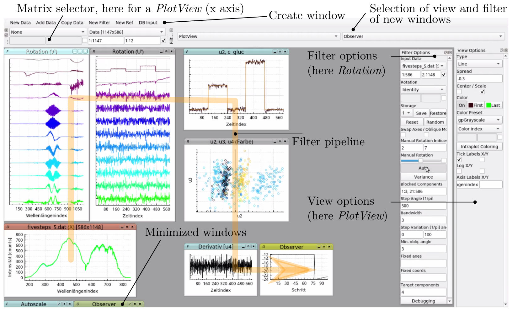

# Review

## Introduction

This is a graphical software for interactive rotational factor analysis and visualization of two-way data, mainly intended for vibrational spectra (Raman, MIR absorption, TDLAS). It can be best introduced as principal component analysis (PCA) plus some facilities for basic manual interaction, namely pairwise orthogonal and oblique rotations of the basis vectors. I called that Manual Factor Analysis (MFA) in my PhD thesis. 

On top of the rotational interface an optimization engine using a simple trust-region algorithm is implemented. Through cyclic testing of rotational directions, user-defined criteria can be optimized. The criteria are defined graphically in a filter pipeline architecture.

There are similarities to Projection Pursuit (PP) and Alternating Least Squares based Multivariate Curve Resolution (MCR-ALS). However, the generic and human-operable data manipulation interface via rotations allows for a combined workflow with both MFA and computer driven optimization. This way, a highly flexible extraction, exploration and isolation of factors can be achieved.

I used and developed this software more or less as a personal tool, so it is probably not as user friendly as it could be. Nevertheless I would be happy if someone could make use of it and maybe leave a comment.

## Operation

Multiple windows can be arranged on the workspace while each window contains

* data or a reference to data,
* a View for visualizing the data and
* optionally a Filter.

A Filter places the result data into the same window. The Views and Filters used for newly created windows are selected from two dropdown menus. When creating a Filter or a reference, the previously selected window is set as input for the new Filter or as target for the reference. This way a Filter pipeline can be built: When data is changed, a signal is propagated through the pipeline, causing subsequent Filters and Views to update their data and visualizations so that the effects of manipulation are becoming apparent immediately. The Filters form a directed acyclic graph which is sorted topologically prior to an update to resolve dependencies.

The Filters comprise arithmetic operations, power, vector length, centering, unit scaling, sorting, differentiation, fast fourier transform, fourier smoothing, 1th order baseline, PCA, statistical metrics (min, max, mean, median, variance) and finally the important Rotation filter which enables manual and computer driven rotations.

A special Filter is the Observer which forms the endpoint of a rotational criterion: When activating computer driven rotations (button "Auto" in Rotation filter controlss), the Rotation filter starts by reversely gathering Observers throughout the Filter pipeline and then uses them for optimization. Filter branches with Observers are cyclically tested for allowed rotational directions while the results are stored and sorted. The q best directions are then applied to the data (filter option "bandwidth"). The optimization can be fine controlled by allowing only oblique rotations for certain components or blocking them completely. Non-blocked components can be reordered by variance by using the "Variance" button in the controls of the Rotation filter.

Currently, text files containing matrix data in the form of space- and LF-separated numbers can be imported. Example data is included in the repository (etc/dat). Two types of Views are implemented: PlotView and ImageView. Both enable panning (left mouse button), rectangle zooming (right button + drag) and mouse wheel zooming. An important interface among others used for visualization controls and filter input is the matrix selector: via a dropdown menu a selection of different data fields and windows is possible. Matrices can be transposed (checkbox) and discontinuous submatrices can be selected by their index. Multiple index ranges (which are denoted by a colon) can be combined via commas (e. g. 1:50, 60:70).

Further tips:

* After selecting "Other" in the matrix/data selector, click on the title bar of the window to be referenced

### Short manual for MFA

Start with a side-by-side view of the factorization (see U' and V' windows top left in the screenshot) and rotate neighbouring components orthogonally (slider "Manual Rotation"). This approach is well suited for exploration. For elimination and isolation of features, use oblique rotations of single components with the other components. 

When using oblique rotations, the order of the rotation indices is important. The fixed basis vector does not change but its coordinates are mixed with the ones of the rotated axis. This allows for a precise assignment of features to components.

After doing some MFA, consider to block valuable components ("Blocked Components") and do a variance reordering of the non-blocked components (button "Variance").

Further tips:

* Use the Storage slots in the Rotation Filter controls to store and recover good rotations
* The step angle also affects manual rotation

### Short manual for computer optimization

Two use cases for automatic rotations can be distinguished: extraction and qualitative optimization. 

Extraction is well suited for high dimensionalities (e. g. enrich signal in the first component as done in PCA/SVD) and can be accomplished by loading the coordinates (not the unit length basis vectors) with the criterion while not stripping the original variance (e. g. by using the Autoscale filter). 

Qualitative optimization can practically be used with arbitrary and the most flexible criteria but requires a limited number of components to rotate with (a full rank matrix can satisfy any criterion!). Consider using only the first 5 to 20 principal components, depending on the number of factors and channels.

Further tips:

* After extraction into component 1, block it and increment target index for sequential NIPALS-like extraction
* The axis/coordinate roles can be swapped by the "Swap Axes" checkbox. The scaling (S as in U S V^T from SVD) is then transferred
* Define only one or a few target components (field "Target components") to make things a lot faster (PP-mode)
* I would recomend using only a single Observer at a time (Observers can be switched on and off)

Examples:

* Observe frequency amplitudes of a FFT to enable an extraction or optimization in frequency domain
* Try sum(abs(diff(*u*))) for a fast non-parametric descriptor of "low frequency" (e. g. rather Raman bands than white noise)
* Observe sum(abs(*u*)) for a simple robust PCA
* Scheme: instead of extracting the interesting stuff, try to find criteria for and then extract interfering factors to remove them from the rest of the data. Block components with the factors and reorder remaining data for variance to better reveal the remaining factors

## Development

The software depends on 

* Qt5
* [QCustomPlot](https://www.qcustomplot.com/) (included in this repository)
* [Armadillo](http://arma.sourceforge.net)
* LAPACK
* BLAS
* [boost::icl](https://www.boost.org/doc/libs/1_64_0/libs/icl/doc/html/index.html)

Next on the development roadmap IMHO:

* simple R interface for data transfer, e. g. review.push(data = X, windowID, dataID = NULL) and X = review.pull(dataID)
* persistence of user settings (settings, filter pipeline)
* simpler arithmetic and bind Filter setup
* better UI controls and feedback (e. g. for matrix transpose, biplot setup in PlotView, reference resettling between windows, Filter/View selection)
* better interface for manual rotation (a select, click & drag mouse gesture for example)
* visualization of the pipeline (simple first version: input windows of selected window are highlighted)
* helper for factor extraction (subsequent enrichment of variance in the first k components as done e. g. in NIPALS. Already started this with tVariable and tTerm to let matrix indices change programatically)
* better optimization engine (stop criteria, optional line-search or even a Levenberg-Marquardt solver)
* add further receipts for MFA and optimization
* refactoring for easier development

